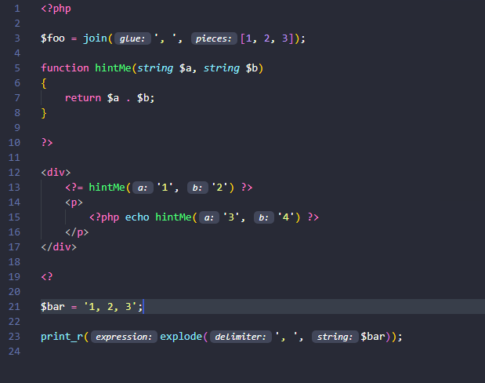

# PHP Parameter Hint for Visual Studio Code

Inserts parameter hints into function calls to easily understand the parameter role.

## Settings

There are currently a few configurable settings in the extension.

| Name                                      | Description                                                                                                                                           | Default  |
| ----------------------------------------- | ----------------------------------------------------------------------------------------------------------------------------------------------------- | -------- |
| `phpParameterHint.enabled`                | Enable PHP Parameter Hint                                                                                                                             | true     |
| `phpParameterHint.margin`                 | Hints styling of margin CSS property                                                                                                                  | 2        |
| `phpParameterHint.fontWeight`             | Hints styling of font-weight CSS property                                                                                                             | "400"    |
| `phpParameterHint.fontStyle`              | Hints styling of font-style CSS property                                                                                                              | "italic" |
| `phpParameterHint.fontSize`               | Hints styling of font size CSS property                                                                                                               | 12       |
| `phpParameterHint.onSave`                 | Create parameter hints on document save                                                                                                               | true     |
| `phpParameterHint.saveDelay`              | Delay in ms for on document save run                                                                                                                  | 500      |
| `phpParameterHint.onChange`               | Create parameter hints on document change                                                                                                             | false    |
| `phpParameterHint.changeDelay`            | Delay in ms for on document change run                                                                                                                | 100      |
| `phpParameterHint.textEditorChangeDelay`  | Delay in ms for on active text editor change                                                                                                          | 750      |
| `phpParameterHint.php7`                   | True if php version is 7.0+, false otherwise                                                                                                          | true     |
| `phpParameterHint.collapseHintsWhenEqual` | Collapse hint when variable name is the same as parameter name, keep the hint if the argument is passed by reference or if the splat operator is used | false    |
| `phpParameterHint.hintOnlyLiterals`       | Show hints only for literals                                                                                                                          | false    |
| `phpParameterHint.hintOnlyLine`           | Show hints only for current line                                                                                                                      | false    |

## Commands

| Name                              | Description                                                 | SHORTCUT                        |
| --------------------------------- | ----------------------------------------------------------- | ------------------------------- |
| `phpParameterHint.toggle`         | Hide / Show Hints                                           | Key: CTRL + K H, Mac: CMD + K H |
| `phpParameterHint.toggleLiterals` | Hide / Show Hints only for literals                         | Key: CTRL + K L, Mac: CMD + K L |
| `phpParameterHint.toggleLine`     | Hide / Show Hints only for current line                     | Key: CTRL + K I, Mac: CMD + K I |
| `phpParameterHint.toggleCollapse` | Hide / Show Hints when variable name matches parameter name | Key: CTRL + K C, Mac: CMD + K C |

## Colors

You can change the default foreground and background colors in the `workbench.colorCustomizations` property in user settings.

| Name                              | Description                                 |
| --------------------------------- | ------------------------------------------- |
| `phpParameterHint.hintForeground` | Specifies the foreground color for the hint |
| `phpParameterHint.hintBackground` | Specifies the background color for the hint |

## Credits

[PHP Parser](https://github.com/glayzzle/php-parser)

[PHP Intelephense](https://github.com/bmewburn/vscode-intelephense)
